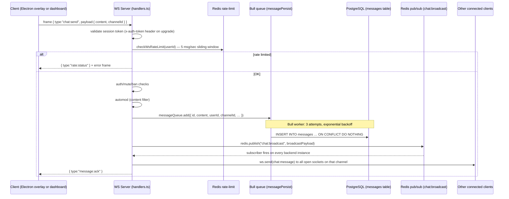
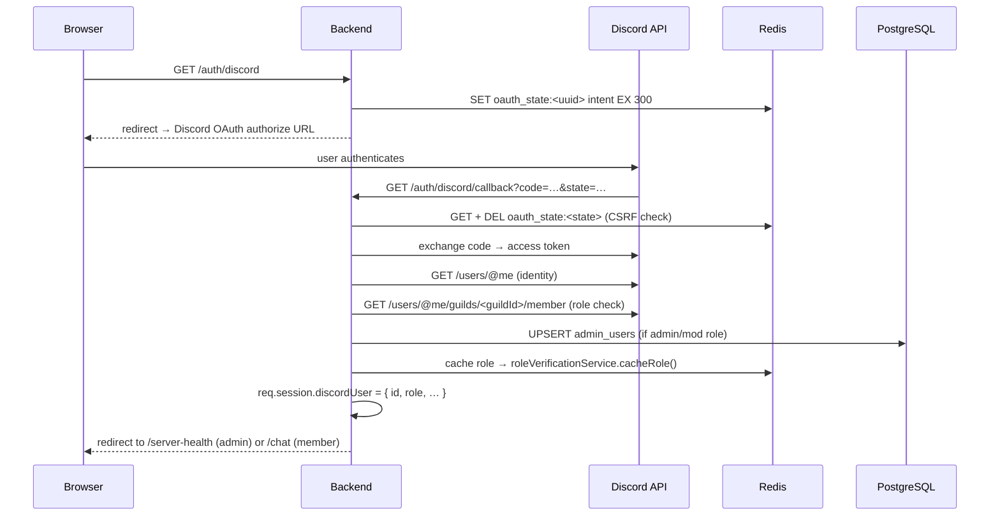

# Data Flow

## Chat Message — End to End

### Community channel message (General / Trading / Events / Raids)



Key files:
- WS handler: `backend/src/websocket/handlers.ts` — `chat:send` case (~line 944)
- Rate limit: `checkWsRateLimit()` in `handlers.ts:709`
- Persistence queue: `backend/src/queues/messagePersist.ts`
- Persist service: `backend/src/services/messageService.ts`
- Broadcast: `broadcast()` in `handlers.ts` publishes to Redis; `initPubSub()` subscribes each instance

### Multi-instance fan-out

Each backend instance subscribes to the Redis `chat:broadcast` pub/sub channel. When a message arrives on one instance, `redis.publish()` fans it out to all instances, which each deliver it to their locally-connected sockets. This makes horizontal scaling possible without sticky sessions.

---

## Auth Flows

### Overlay client (anonymous install token)

```mermaid
sequenceDiagram
    participant O as Overlay (Electron)
    participant API as Backend REST
    participant Redis as Redis
    participant DB as PostgreSQL

    Note over O: First launch — generates UUID installToken, stored in overlay-state.json
    O->>API: POST /api/auth/register { installToken, username }
    API->>DB: UPSERT users WHERE installToken=…
    API->>Redis: SET session:<token> userId EX 86400 (24 h)
    API-->>O: { data: { token } }
    Note over O: Stores token; sends as x-auth-token header on all subsequent requests and WS upgrade
    O->>API: GET /api/channels  (x-auth-token: <token>)
    API->>Redis: GET session:<token> → userId
    API-->>O: { data: [ channels ] }
    O->>API: WS upgrade (x-auth-token: <token>)
    API->>Redis: validates token → userId
    Note over O,API: Persistent WebSocket open
```

### Discord OAuth2 — admin dashboard login



### Discord account linking — overlay client

The overlay can link its anonymous install token to a Discord identity via an in-app browser pop-up. The flow is:

1. Overlay opens `GET /auth/discord/link?installToken=<token>` in a browser window.
2. Backend stores `oauth_link_state:<uuid> = installToken` in Redis (5 min TTL) and redirects to Discord OAuth.
3. Discord calls back to `/auth/discord/link/callback`.
4. Backend validates state, exchanges code, verifies guild membership, upserts the `users` row with `discordId` / `discordUsername` / `discordDisplayName`.
5. If another row already owns that `discordId` (account reclaim), `mergeUserInto()` re-points all FK tables and deletes the placeholder.
6. Backend stores `discord_link:<installToken>` in Redis (10 min); overlay polls `GET /api/auth/discord-status/:installToken` until it sees `linked:true`.

---

## Discord Bridge

The Discord bridge is **bidirectional** but scoped to a single configured text channel (`DISCORD_CHANNEL_ID`). Parties are **not** bridged.

```
Game client
    │  chat:send (community channel)
    ▼
WS handler (handlers.ts)
    │  relayToDiscord(channelId, username, content)
    ▼
discordService.ts → outboundQueue (drains at 4 msg/sec)
    │
    ▼
Discord text channel

Discord text channel
    │  messageCreate event (discord.js Client)
    ▼
discordService.ts — echo-loop guard (ZWS watermark), automod check, resolveInboundUserMentions()
    │  broadcast({ type:"chat:message", payload:{ source:"discord", … } })
    ▼
All connected overlay clients (community channel feed)
```

Key implementation details (`backend/src/services/discordService.ts`):
- Outbound queue drains at 250 ms intervals (4 msg/sec) to respect Discord rate limits.
- A zero-width space (`​`) watermark is appended to all game→Discord messages; the inbound handler rejects messages containing this watermark to prevent echo loops.
- Mention tokens (`@everyone`, `<@id>`, `<@&roleId>`) are stripped from outbound game messages via `stripMentions()`.
- Inbound Discord mentions (`<@id>`) are resolved to FO76 usernames or Discord display names via a batched DB lookup before the message is relayed to overlays.

---

## Presence Heartbeat

Overlay clients send `presence:update` every 60 seconds while in-world. The backend reaper nulls the stored endpoint if no heartbeat arrives within the window. See memory note `project_inworld_heartbeat.md`.

---

## Related docs

- [README.md](./README.md) — system overview
- [system-overview.md](./system-overview.md) — component table, rate limits, layer order
- [glossary.md](./glossary.md) — domain terms
- [../realtime/](../realtime/) — WebSocket protocol reference (TODO)
- [../discord/](../discord/) — Discord bot features in detail (TODO)
