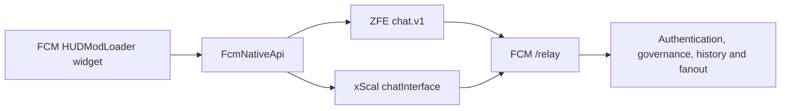

# FCM native HUD chat relay

The active in-game HUD uses FCM's `FCMChatWidget.swf` with ZFE `chat.v1` or xScal
`chatInterface`. The backend `/relay` adapter is implemented. The older plan to ship the generic
FCMHUD socket transport while waiting for native chat is superseded.

The diagram shows alternatives; discovery selects one provider. This optional mod does not
require or modify the desktop overlay. Extenders own native networking and local tokens. The
widget reads only HUD-published data and exposed APIs.

## Maintained references

| Topic | Reference |
| --- | --- |
| Adapter, auth, operations, cosmetics, controls | [FCM integration](fcm-integration.md) |
| Reconnect snapshots, cursors, bounded recovery | [Recovery contract](reconnect-history-recovery-spec.md) |
| Current-room SERVER isolation | [Server session binding](server-session-binding.md) |
| Retry receipts and ambiguous sends | [HUD retry safety](../hud-send-retries.md) |
| Build status and installation | [HUD index](../README.md), [widget build guide](../../../../game-mods/FCMBridge/hudmodloader-chat/BUILD.md) |
| Upstream contract | [ZFE author's chat relay guide](https://www.nexusmods.com/fallout76/articles/256) |

The [local protocol snapshot](protocol-spec.md) records an earlier upstream contract. It is not
a verbatim or exhaustive description of every current ZFE release. Check runtime capabilities
and the author's current guide before changing an adapter. xScal uses different callable
signatures even when the relay operations have the same meaning.

## Delivery and duplicate protection

The relay reuses existing identity, moderation, channel, queue, Redis, and Discord services.
Static native sends broadcast and ACK after durable queue acceptance; they do not wait for a
worker to complete database persistence. Ordinary web producers retain their persistence fence.
SERVER delivery is room-scoped Redis history/fanout. Neither ACK means confirmed Discord delivery.
See [retry safety](../hud-send-retries.md) for crash windows and negotiated retries.

In the widget, General is a view over six source channels, not a relay destination for copied
messages. Retained message IDs, provider event IDs, pending echoes, and world-room membership
have separate guards. The [integration guide](fcm-integration.md) and
[recovery tests](../../../testing/hud-recovery.md) document their ordering and scope.

The old line-feed protocol `FCMHUD/1` is retired for this widget. The similarly named
`FCMHUD/1;...` carrier remains active inside native event `targetUserId` to preserve canonical
message identity and validated cosmetics across extenders that discard unknown JSON members.

Historical Windows/Proton success is recorded in [Proton status](proton-status.md); it is not
proof that an untested provider/game/build combination works. Production exposure still requires
the backend's `RELAY_PRODUCTION_ENABLED` configuration; this document does not assert live state.
